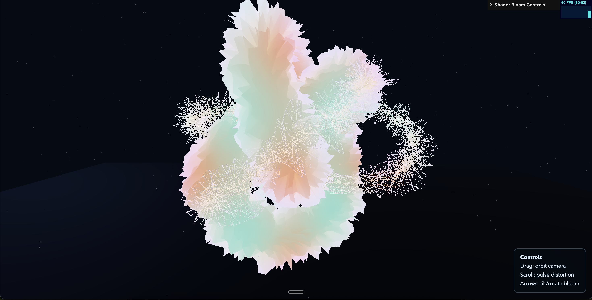

# Shader Bloom Scene (Three.js)

This project implements a custom **interactive WebGL scene** using `ShaderMaterial` as the main material, based on the same architecture used in `example-app`.

## What was implemented

- A full-screen Three.js scene that starts directly from `/`.
- Main object built with `ShaderMaterial` (core mesh + wireframe shell).
- Additional scene elements for composition and depth:
  - atmospheric fog
  - floor plane
  - particle dust field
  - key/fill lighting setup
- Live tuning panel with `lil-gui`.

## Interaction

- **Drag**: orbit camera (`OrbitControls` with damping).
- **Scroll**: increases distortion energy and shifts wave phase over time.
- **Arrow keys**: tilt/rotate the main form and modulate deformation.
- **Mouse position**: affects local pulse around the pointer area (via shader uniform).

## Shader explanation (what and why)

The shader is designed to avoid a static "basic material" look and make the shape feel alive and responsive.

### Vertex shader (`src/App/shaders/two/vertex.js`)

- Uses mixed sine/cosine wave fields + a per-vertex random attribute (`aRandom`) to deform the geometry.
- Applies displacement along normals so the shape keeps volume while moving.
- Adds pointer-based radial pulse in world space for local interaction.
- Exposes varyings (`vWave`, `vPulse`, normals/world position) for shading in the fragment stage.

**Why:** this creates organic, non-uniform motion with controllable intensity while remaining lightweight and real-time friendly.

### Fragment shader (`src/App/shaders/two/frag.js`)

- Blends three palette colors through animated world-space bands.
- Uses a Fresnel term for edge glow and depth perception.
- Mixes in pointer pulse contribution for interaction feedback.
- Includes Three.js tone-mapping and color-space chunks to match renderer output.

**Why:** this gives a stylized look with readable volume, better contrast at silhouettes, and visual response tied to interaction.

## Performance / quality decisions

- DPR is clamped: `Math.min(window.devicePixelRatio, 2)`.
- Antialiasing is enabled only on lower DPR displays (`<= 1.5`) to balance quality and GPU cost.
- Proper resize handling updates renderer size, pixel ratio, and camera projection.

## Project structure

```text
src/
  App/
    index.js
    shaders/
      two/
        vertex.js
        frag.js
  main.js
  style.css
```

## Run locally

```bash
npm install
npm run dev
```

## Node version

This repo includes `.nvmrc`:

```text
20.19.0
```
